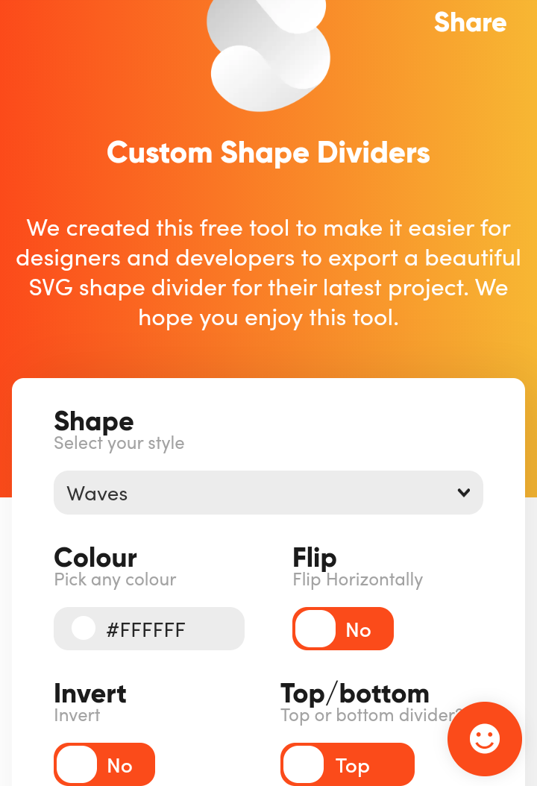
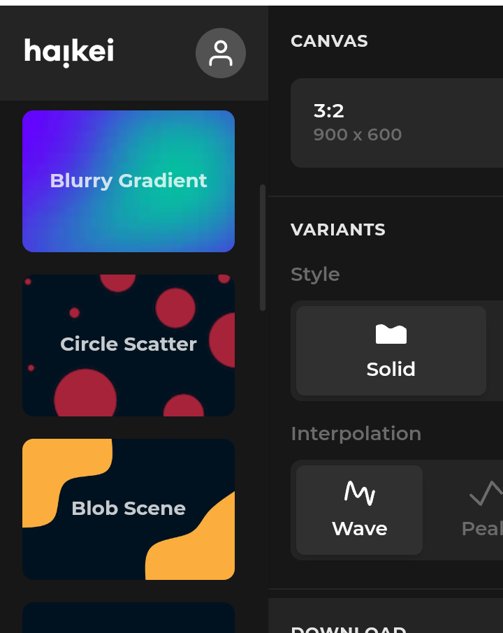
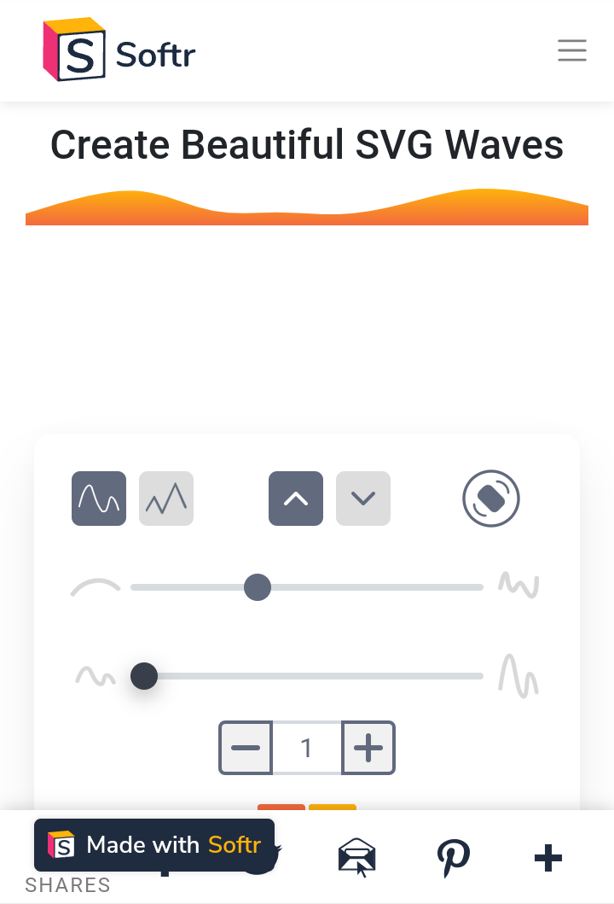
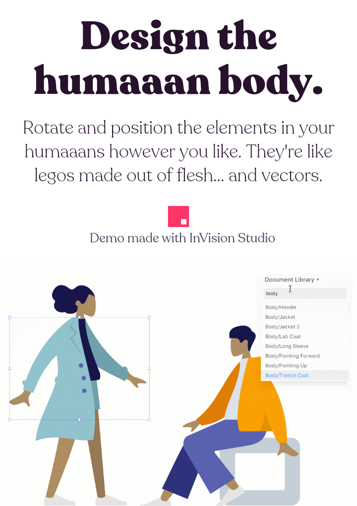
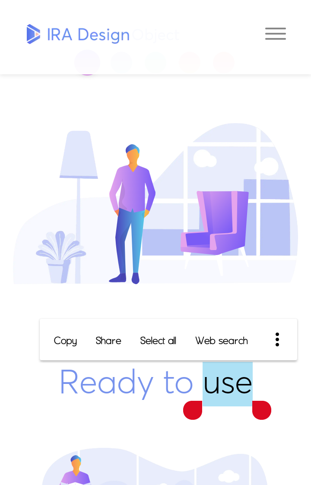
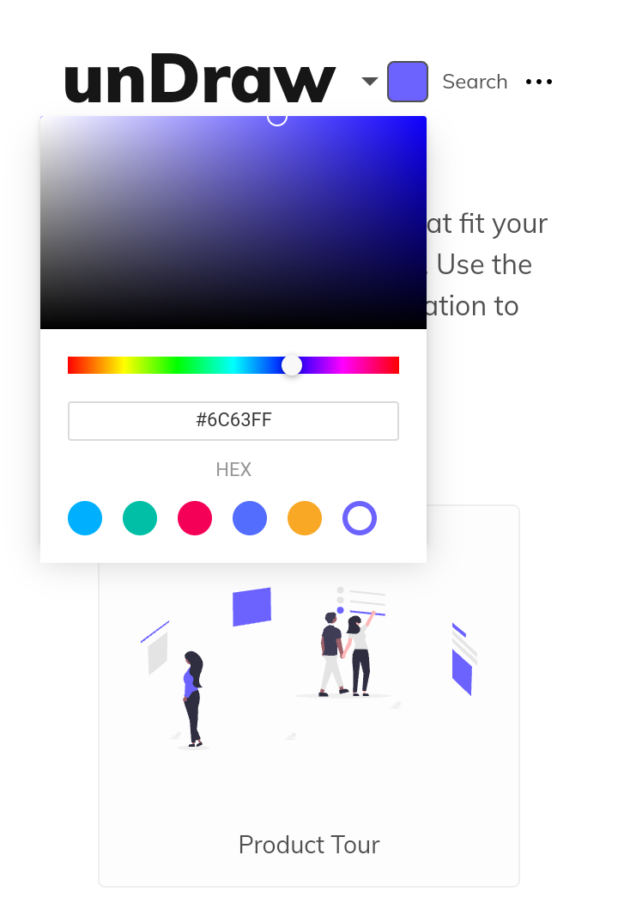
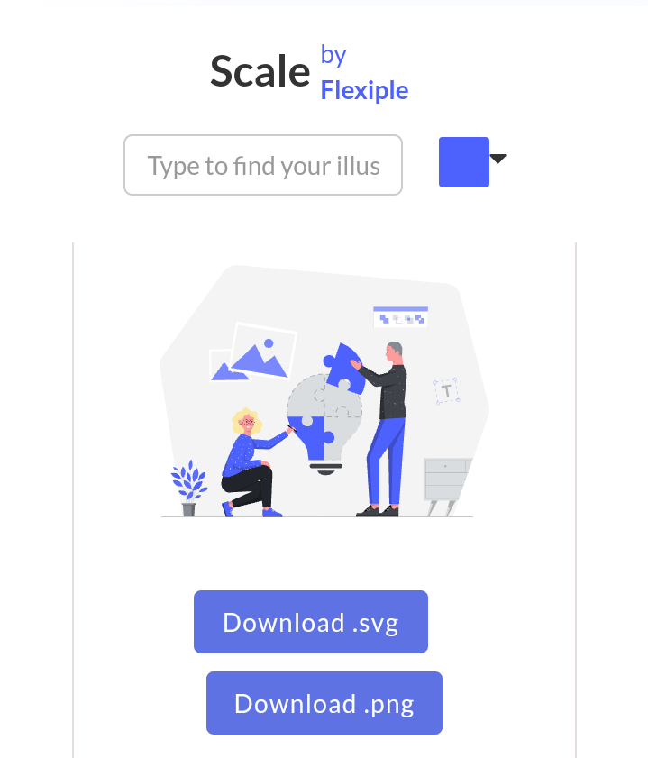

# @Meta-Data :octocat:
 A collection of assets - _images_, _snippets,_ _repos_, _templates_ and more for web and hybrid application developer using stacks common as at the compilation of this document. Stacks like:
 - MEVN   :sparkles:
 - MEAN :fire:
 - LAMP :v:
 - XAMPP :+1:
 - WAMPP :stuck_out_tongue_winking_eye:
 

## Table of Content 
- [x] [Collection of open source images](#images) :foggy:
- [x] [Collection of open source svg backgrounds](#svg-background)
- [x] [CSS Rule generators](#css-rule-generators)
- [x] [JavaScript UI library](#javascript-libraries)
- [x]  [SVG illustrations](#svg-illustrations)
- [x] [UI templates & patterns](#ui-templates-&-patterns)
- [x] [Icon libraries](#icon-libraries) :mag: 
- [x] [Work arounds](#work-arounds) :horse_racing:
 

# High Quality Images :rocket:

 :one:  <a  href="https://www.freepik.com" target="_blank">freepik</a>

  > Background Image 
  > Free vectors 
  > Logo image 
  > Design Image & more
  > Abstract background
  

 :two:  <a  href="https://www.pexels.com/" target="_blank" target="_blank">Pexels</a>
 > Free photos 
 > Background photos
 > Best freestocl videos
 > city pictures
  
 :three:  <a  href="https://www.unsplash.com" target="_blank">Unspalsh</a>
 > Free pictures
 > Wallpaper 
 > Nature
 > Women
 > Nature & more categories
 
more...

 :four:  <a  href="https://www.pixabay" target="_blank">Pixabay</a>
 :five:  <a href="https://www.freeimages.com" target="_blank">Freeimages</a>
 :six: <a href="https://wwwshutterstock.com" target="_blank">Shutterstock</a>

# SVG Background 

:one:  <a href="https://www.shapedivider.io" target="_blank">shapedivider</a>
>Custom Shape Dividers. 
>We created this free tool to make it easier for designers and developers to export a beautiful SVG shape divider for their latest project. We hope you enjoy this tool. :wink:

 :two:  <a href="https://app.haikei.app" target="_blank">Haikie</a>
>Generate pattern background ideal for website _hero_ section
 :satisfied:

:three:  <a href="https://www.softr.io/tools/svg-wave-generator" target="_blank">Softr</a>
> Personally,I consider this way cooler than  _[shapedivider](shapedivider.io)_, with it, you can generate a shape with a gradient color :+1:

:four:  <a href="https://www.blobmaker.app/" target="_blank">blobmaker</a>

# CSS Rules generators 

:one:  <a href ="https://www.animista.net" target="_blank">Animista</a>
>Animista is a CSS animation library and a place where you can play with a collection of ready-made CSS animations and download only ...

:two:  <a href="https://www.cssgradient.io" target="_blank">CSS gradient</a>
>As a free css gradient generator tool, this website lets you create a colorful gradient background for your website, blog, or social media ... :point_up:

:three:  <a href="https://uigradients.com/" target="_blank">UI gradient</a>
Just like <a href="https://www.cssgradient.io" target="_blank">Css gradient</a>
A handpicked collection of beautiful color gradients for designers and developers.

:four:  <a href="https://bennettfeely.com/scales/" target="_blank">bennettfeely</a>
>Diverging and sequential color scales from ColorBrewer and van der Walt, Smith and Firing, approximated as CSS gradients.

The gradients not only look great but are accessible and contain a wide range of colors suitable for people with colorblindness.

*support SCSS, JS array of color and color listing*

#SVG illustrations

 :one:  <a  href="https://www.freepik.com" target="_blank">freepik</a>
 
 
 :two:  <a  href="https://www.humaaans.com
" target="_blank">Humaaans</a>

> Mix-&-match illustrations of people with a design library for InVIsion Studio and Sketch.

:three:   <a  href="https://iradesign.io" target="_blank">IRA design</a>
>Build your own amazing illustrations
Using our awesome gradients and hand drawn sketch components. <a href="https://iradesign.io/gallery/illustrations" target="_blank">Quick Start with IRA design gallery</a>

:four:   <a  href="https://undraw.co/illustrations
" target="_blank">Undraw</a>

> unDraw · Open-source illustrations for any idea you can imagine and create. · A constantly updated design project with beautiful SVG images ...

:five: <a href="https://2.flexiple.com/scale/all-illustrations#" target="_blank">2.Flexiple

>One new high-quality, open-source illustration each day. Use our color-picker to adapt the illustrations to your brand identity! ...

# JavaScript UI library
<a name="javascript-ui-libraries"><a>
:one:  <a href="https://bennettfeely.com/ztext/" target="_blank">Ztext.js</a>
>Easy to implement, 3D typography for the web. Works with every font.

# UI Design Pattern & Template 

:one:  <a href="https://mobbin.design" target="_blank">Mobbin</a>
>Discover the latest iOS UI design patterns
Mobbin is a hand-picked collection of the latest mobile design patterns from apps that reflect the best in design. Get inspiration from over 250 iOS apps and 25,000 patterns (screenshots from iPhone 12) available on the platform. Sign up to save your favorite patterns

:two:   <a href="https://dribbble.com
" target="_blank">Dribble</a>

>Dribbble is the leading destination to find & showcase creative work and home to the world's best design professionals.
It offers 
> Mobile and web templates amings other things

# Icons library

:one:  <a href="https://www.flaticon.com
" target="_blank">Flaticon</a>

>The largest database of free icons available in PNG, SVG, EPS, PSD and BASE 64 formats.

:two:   <a href="https://fontawesome.com" target="_blank">Font awesome</a>
>The next generation of our icon library + toolkit is coming with more icons, more styles, more services, and more awesome. Pre-order now to get access to our alpha and future releases!
_personally I love this, it comes with cooler update everytime_

:three:   <a href="https://icons8.com
" target="_blank">Icons8</a>
> Image, Icons, vector, music and more work around

# Work arounds

:one:  <a href="https://icons8.com/bgremover" target="_blank"> Icon8 background remover</a>
:two:  <a href="https://www.remove.bg" target="_blank">Background remover</a>
:three: <a href="https://mdbootstrap.com/docs/standard/tools/" traget="_blank">aterial design bootstrap</a>
