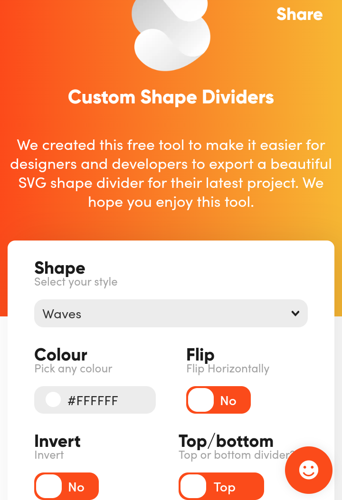
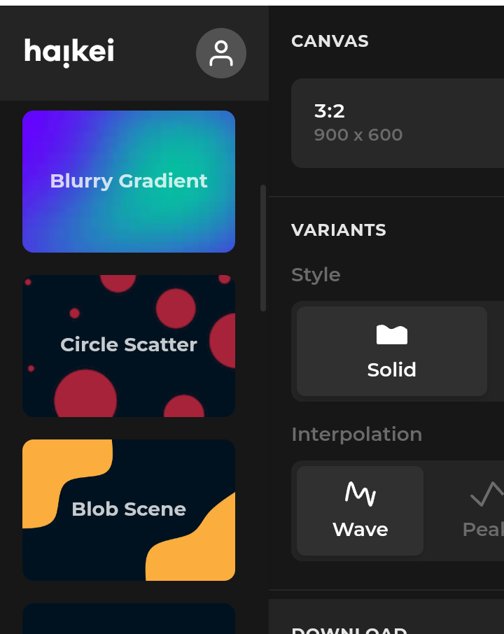
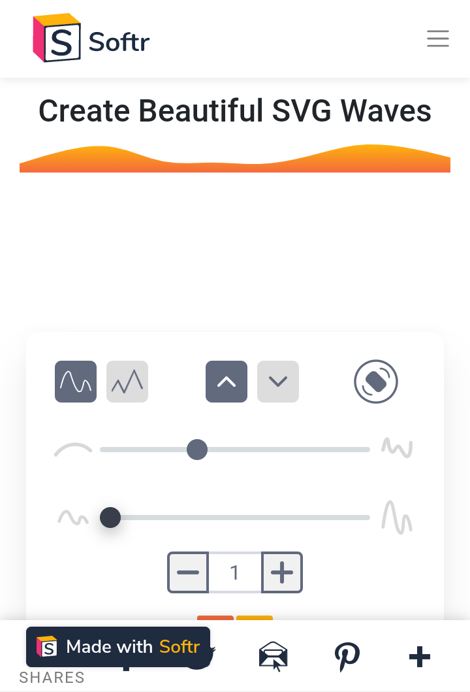

# SVG Background 

1. <a href="https://www.shapedivider.io" target="_blank">shapedivider</a>
>Custom Shape Dividers. 
>We created this free tool to make it easier for designers and developers to export a beautiful SVG shape divider for their latest project. We hope you enjoy this tool. :wink:

 2. <a href="https://app.haikei.app" target="_blank">Haikie</a>
>Generate pattern background ideal for website _hero_ section
 :satisfied:

3. <a href="https://www.softr.io/tools/svg-wave-generator" target="_blank">Softr</a>
> Personally,I consider this way cooler than  _[shapedivider](shapedivider.io)_, with it, you can generate a shape with a gradient color :+1:

4. <a href="https://www.blobmaker.app/" target="_blank">blobmaker</a>
